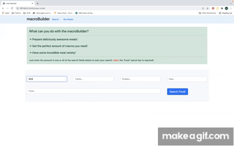
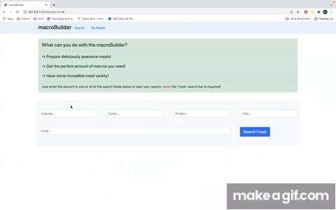
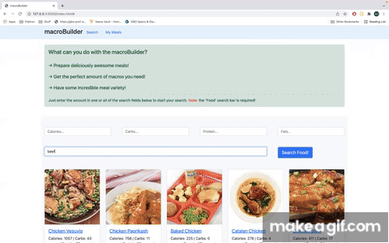
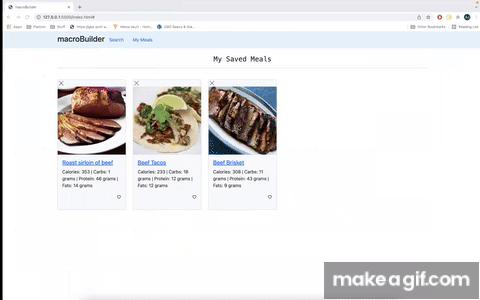

# The macroBuilder app

>One stop shop to meet all your caloric-deficits and macros in one simple search!

## Project Philosophy

This project was made with the intention of targeting health concious, fitness centered individuals who wants to [start](https://blog.eatthismuch.com/what-you-should-know-about-counting-macros/) (or is currently) counting their `calories` and `macros` (macronutrients).

One of the most common stereotypes for individuals who count their calories/macros is that they eat boring, unsatisfying foods. This app makes it easier for any individual to start counting their calories and macros while preparing tasty foods.

## Features

- Can search through millions of recipes with the [edamam api](https://developer.edamam.com/)
- Can specify how much calories or macros needed in the search
- Can save recipes you find interesting or want to cook
- Can favorite recipes if you want to cook them again later or for any other reason

## How to Use

1. Start the search by putting in the type of food you want (ex: chicken, beef, pasta, etc.):
2. You can specify the amount of calories and macros you want (must be a number):
> 
3. You can opt to use just 1, 2, 3, or all of the search bars, but the `Food` search bar is always required:
> 
4. Save recipes using the `Add` button. It will then go into the `My Meals` tab:
> )
5. In the `My Meals` tab, you can remove recipes you don't want anymore, or favorite recipes you really like by clicking on the empty heart icon:
> )

## Technologies used

This web app was made using: 
- [Bootstrap](https://getbootstrap.com/) (a CSS framework) 
- Vanilla JavaScript  
- [Edamam api](https://developer.edamam.com/) 
- JSON server

